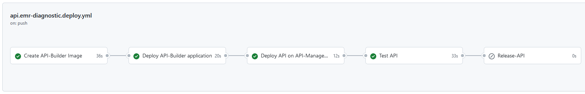

## EMR-DiagnosticInfo

### Summary

This API is implemented by an API-Builder microservice. Changes to the API configuration or microservice result in 
a deployment to the API management platform and then the API is tested end-to-end.  



### Technical details

#### API-Configuration

The defined [API specification](config/EMR-DiagnosticInfo.json) is referenced by the [API config file](config/api-config.json). 
When changes are made the API is replicated into the API-Management platform by the 
GitHub workflow [api.emr-diagnostic.deploy.yml](../.github/workflows/api.emr-diagnostic.deploy.yml) 
using the [APIM CLI](https://github.com/Axway-API-Management-Plus/apim-cli). A Backend-Path is configured for this API, that points to 
the API-Builder Microservice based on the deployed service:
```json
"backendBasepath" : "http://api-emr-diagnostic:8080/api/api/emr/diagnostic/"
```

The integration of the APIM CLI is based on Maven, therefore a corresponding [pom.xml](pom.xml) defines the dependency.

```xml
    <dependencies>
        <dependency>
            <groupId>com.github.axway-api-management-plus.apim-cli</groupId>
            <artifactId>apimcli-apis</artifactId>
            <version>1.3.11</version>
        </dependency>
    </dependencies>
```

In the workflow, just Maven is then called to replicate the API.

```yaml
      - name: Deploy API
        env:
          APIM_USER: ${{ secrets.APIM_USER }}
          APIM_PASS: ${{ secrets.APIM_PASS }}
          APIM_HOST: ${{ secrets.APIM_HOST }}
          APIM_PORT: ${{ secrets.APIM_PORT }}
        run: mvn clean exec:java
```

#### API-Builder Microservice

The [API-Builder](https://docs.axway.com/bundle/api-builder/page/docs/index.html) microservice, which implements the API as a mock, 
is located in the directory: [emr-diagnostic-app](emr-diagnostic-app). When you check out the project, you can start the API Builder 
project locally to see the simple mock implementation.  

```
git clone https://github.com/Axway-API-Management-Plus/axway-api-management-automated.git
cd axway-api-management-automated/api-emr-diagnostic/emr-diagnostic-app
npm start
```

After starting the API-Builder process locally using npm start you can point your browser to: http://localhost:8080/console

As part of the CI/CD workflow, a Docker image for the API-Builder application is created and rolled out in 
Kubernetes using the [deployment](config/api-deployment.yaml).


#### Tests

As the last component of the CI/CD workflow, the API is tested end-to-end. Incl. configured API security. Newman is used for this purpose. 

```yaml
  test-api:
    if: "!contains(github.event.head_commit.message, 'skip ci')"
    name: Test API
    runs-on: ubuntu-latest
    needs: deploy-api
    steps:
      - name: Checkout
        uses: actions/checkout@v2
      - name: Install newman
        run: sudo npm -g install newman
      - name: Run API tests
        run: |
          sleep 1
          newman run ./tests/DiagnosticAPI.postman_collection.json -e ../lib/Demo-Environment.postman_environment.json --reporter-json-export output.json --insecure
```
