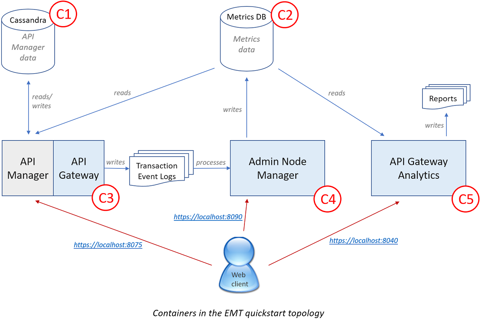

# Externally Managed Topology (EMT)

1. [Introduction](#introduction)
2. [Prerequisites](#prerequisites)
3. [Scripts](#scripts)
4. [Quick Start Tutorial](#tutorial)
    * 4.1 [Setup](#setup)
    * 4.2 [Create base Docker image](#create_base_image)
    * 4.3 [Generate domain certificate](#gen_domain_cert)
    * 4.4 [Create ANM image and start container](#create_anm_image)
    * 4.5 [Create API Manager image and start container](#create_apimgr_image)
    * 4.6 [Create API Gateway Analytics image and start container](#create_analytics_image)
5. [Persisting log files outside API Gateway container](#persist_logs)
6. [Runtime parameters](#runtime_params)
    * 6.1 [Environment variables for controlling an EMT system](#emt_env_variables)
    * 6.2 [Adding files to containers in the runtime environment](#add_runtime_files)


## 1. Introduction <a name="introduction"></a>

From release 7.6 onwards, the Axway API Gateway is capable of running in Externally Managed Topology
(EMT) mode. This is significantly different from 7.5.3 and earlier:
- The API Gateway topology is managed by Docker, not the Admin Node Manager.
- The API Gateway configuration (FED file) is baked into the Gateway's Docker image. To update the
FED, a new image should be built and deployed through a rolling update.
- A Gateway domain comprises an Admin Node Manager (ANM) and one or more API Gateways. There are no
non-Admin Node Managers present.

To run the API Gateway in EMT mode, you need to create Docker images for the ANM and API Gateway,
then start containers from them. It is easy to scale a domain up or down by starting or stopping
containers. This can be done automatically by a container orchestration manager such as Kubernetes.

API Gateway Analytics has also been adapted to run in a Docker container. Analytics is a standalone
client of the Metrics database, and is not part of an API Gateway domain.

This document provides a quick tutorial on building and starting a full API Management solution in
EMT mode. The accompanying `quickstart.sh` script contains all the steps described here, and can be
executed to bring up a full demo environment. For help on running this script, type

```sh
./quickstart.sh -h
```

The full quickstart solution is shown below. It includes five Docker containers, numbered C1-C5:
- C1 is a Cassandra database that stores API Manager data.
- C2 is a MySQL database that stores metrics data.
- C3 is an API Gateway instance with API Manager configured. The API Manager Web UI is available at
https://localhost:8075
- C4 is an Admin Node Manager. It exposes a Web UI at https://localhost:8090
- C5 is in instance of API Gateway Analytics. Its Web UI is at https://localhost:8040

The diagram also shows the flow of metrics data. Transaction Event Logs record details of every
transaction passing through the API Gateway. The Admin Node Manager processes these logs, generates
metrics and writes them to the Metrics Database. These metrics are then read by API Manager and API
Gateway Analytics.




## 2. Prerequisites <a name="prerequisites"></a>

To create Docker images for the ANM, API Gateway and API Gateway Analytics, you will need
- A copy of the EMT image generation scripts. These are distributed as a zip archive containing an
`apigw-emt-scripts` directory.
- An API Gateway 7.6+ installer.
- A valid license for API Manager, and optionally for API Gateway Analytics.
- Version 5.1 of the MySQL JDBC JAR, e.g., mysql-connector-java-5.1.47.jar. This is used to connect
  to the Metrics database from the ANM, API Manager and API Gateway Analytics. It can be downloaded
  from here: https://dev.mysql.com/downloads/connector/j/

The EMT image generation scripts are designed to run in a Linux environment. They require the
following packages to be installed locally: Docker, Python and OpenSSL. Testing has been performed
with the following versions, although others may also work:
- Docker 18.03-ce
- Python 3 
- OpenSSL 1.1.0f


## 3. Scripts <a name="scripts"></a>

The following scripts are provided for building ANM, API Gateway and API Gateway Analytics images:
<dl>
  <dt>gen_domain_cert.py</dt> <dd>Generates a self-signed CA cert or a CSR for an API Gateway
  domain.</dd>
  <dt>build_base_image.py</dt> <dd>Builds the base Docker image for API Gateway and Admin Node
  Manager.</dd>
  <dt>build_anm_image.py</dt> <dd>Builds a Docker image for the Admin Node Manager.</dd>
  <dt>build_gw_image.py</dt> <dd>Builds a Docker image for an API Gateway.</dd>
  <dt>build_aga_image.py</dt> <dd>Builds a Docker image for API Gateway Analytics.</dd>
</dl>

The four `build_*` scripts are thin wrappers around Dockerfiles. They ensure that all required
parameters have been provided, and copy resources to the correct location before `docker build`
is executed.

To view the available options for a script, run `<script-name> -h`, e.g.,

```sh
./gen_domain_cert.py -h
```

## 4. Quick Start Tutorial <a name="tutorial"></a>

In this tutorial, we will

1. Create a base Docker image containing an OS and an API Gateway installation. This is the parent
   image for ANM and API Gateway images.
2. Generate a domain certificate.
3. Create a Docker image for Admin Node Manager (ANM) and start an ANM container.
4. Create a Docker image for API Manager and start an API Manager container.
5. Create a Docker image for API Gateway Analytics and start an Analytics container. This is an
   optional step, and can be skipped if you don't have an Analytics license.

Note that a clear distinction should be drawn between building an image and starting a
container. Image creation typically takes place in a build/CI environment, with various artifacts
checked out of source control and assembled in a versioned, immutable image. This represents the
unit of deployment in EMT mode. Containers are later started from this image in a specific runtime
environment, e.g., dev, staging or production. The two can also be pulled together into a single
CI/CD pipeline, where artifact updates trigger a new build that leads to the automatic creation or
refresh of an execution environment.


### 4.1 Setup <a name="setup"></a>

Before starting to build Docker images, let's create all the files and folders that we'll need. Note
that the license file should be valid for API Gateway, API Manager and API Gateway Analytics.

```sh
mkdir -p /tmp/emt/events /tmp/emt/apigateway/ext/lib /tmp/emt/analytics/ext/lib /tmp/emt/reports /tmp/emt/sql

cd apigw-emt-scripts
cp <path-to-api-gateway-installer> ./apigw-installer.run
cp <path-to-api-gateway-license> ./license.lic
cp quickstart/mysql-analytics.sql /tmp/emt/sql
cp <path-to-mysql-jdbc-jar> /tmp/emt/apigateway/ext/lib
cp <path-to-mysql-jdbc-jar> /tmp/emt/analytics/ext/lib
```

We'll use a dedicated Docker network called 'api-gateway-domain' so that all containers in the
domain can communicate with one another more easily:

```sh
docker network create api-gateway-domain
```

We also need to start the two external data stores, Cassandra and MySQL:

```sh
docker run -d --name=casshost1 --network=api-gateway-domain cassandra:2.2.12

docker run -d --name metricsdb --network=api-gateway-domain \
           -v /tmp/emt/sql:/docker-entrypoint-initdb.d \
           -e MYSQL_ROOT_PASSWORD=root01 -e MYSQL_DATABASE=metrics \
           mysql:5.7
```

For the MySQL container, environment variables are used to set the root password and to create a
database called `metrics`. Host directory `/tmp/emt/sql` is mounted inside the container; the SQL
file it contains is executed at initial startup to create the metrics tables inside the database.


### 4.2 Create base Docker image <a name="create_base_image"></a>

The base image contains an OS and an installation of API Gateway. It serves as the parent for
the ANM and API Gateway images. Two operating systems are supported: Red Hat Enterprise Linux 7
(RHEL7) and CentOS 7. When creating a base image, you can either specify the OS or else supply the
name of a Docker image based on RHEL7 or CentOS 7.

Let's build a base image with a CentOS 7 OS:

```sh
./build_base_image.py --installer=apigw-installer.run --os=centos7
```

### 4.3 Generate domain certificate <a name="gen_domain_cert"></a>

Every API Gateway domain has a single domain cert. This is used to sign all the ANM and Gateway
certs in the domain, allowing them to communicate with one another using 2-way TLS.

In production, the domain private key would be protected by a secure password. In a test
environment, we can generate a default domain cert for convenience:

```sh
./gen_domain_cert.py --default-cert
```

### 4.4 Create ANM image and start container <a name="create_anm_image"></a>

The Admin Node Manager has a reduced role when a Gateway domain is running in EMT mode. It is no
longer responsible for managing the topology (i.e., adding or removing Groups and Gateways), and
cannot be used to deploy policy packages (FED files) to Gateways.

The ANM is still useful for showing the Gateways that are currently running, viewing their logs and
traffic, and updating certain Gateway settings such as trace level. It is also still responsible for
processing Transaction Event Logs from API Gateways and writing the resulting metrics to the
Metrics database.

There are many possible options when creating an ANM image. Let's create an ANM with a default admin
user and factory FED. We will use the --merge-dir option to pass the MySQL JDBC JAR into the ANM
image:

```sh
./build_anm_image.py --default-cert --default-user --metrics --merge-dir=/tmp/emt/apigateway
```

Now we can start a container from this image. Host directory `/tmp/emt/events` is mounted inside the
container and contains Transaction Event Logs from API Gateways. Connection details for the Metrics
database are passed into the container as environment variables.

```sh
docker run -d --name=anm --network=api-gateway-domain \
              -p 8090:8090 -v /tmp/emt/events:/opt/Axway/apigateway/events \
              -e METRICS_DB_URL=jdbc:mysql://metricsdb:3306/metrics?useSSL=false \
              -e METRICS_DB_USERNAME=root -e METRICS_DB_PASS=root01 \
              -e ACCEPT_GENERAL_CONDITIONS=yes \
              admin-node-manager
```

You can login to the API Gateway Manager UI at https://localhost:8090 with credentials admin/changeme.


### 4.5 Create API Manager image and start container <a name="create_apimgr_image"></a>

The Admin Node Manager provides support services for an API Gateway domain, but all traffic handling
is carried out by API Gateways. Some API Gateways are also configured as API Managers, and so expose
the API Manager UI and an additional traffic port.

Each Gateway image represents a separate 'Group' in the topology. For example, two Gateway images
could be created, one with API Manager and the other containing a set of orchestration policies. Two
separate groups of Gateways could be started from these images, each running in a different location
and scaling independently.

In production, an API Manager FED would always be provided. In a development environment, we can
build a default API Manager image with a factory FED. Once again, the MySQL JDBC JAR for connecting
to the Metrics database is passed in via the --merge-dir option:

```sh
./build_gw_image.py --license=license.lic --merge-dir=/tmp/emt/apigateway --default-cert --api-manager
```

Let's start an API Manager container from this image. Several extra parameters are specified in the
command below:
* Host directory `/tmp/emt/events` is used to store Transaction Event Logs. As mentioned above, the
  ANM processes these log files to generate metrics.
* Environment variable EMT_DEPLOYMENT_ENABLED indicates that deployment of a new FED into the
  Gateway container should be allowed from Policy Studio. This is useful in a development
  environment where policies need to be deployed frequently as they are written and debugged. In
  production, the set of policies is fixed and this option should not be used; policy updates should
  be distributed by building a new image and deploying it via a rolling update.
* The ANM address is passed in as an environment variable so that the new Gateway can register its
  presence. This allows the ANM to build up a picture of the topology and display it in the API
  Gateway Manager UI.
* Connection details are passed in for the Cassandra server that stores API Manager data, and the
  Metrics database that supplies metrics for the API Manager UI.

```sh
docker run -d --name=apimgr --network=api-gateway-domain \
           -p 8075:8075 -p 8065:8065 -p 8080:8080 \
           -v /tmp/emt/events:/opt/Axway/apigateway/events \
           -e EMT_DEPLOYMENT_ENABLED=true -e EMT_ANM_HOSTS=anm:8090 -e CASS_HOST=casshost1 \
           -e METRICS_DB_URL=jdbc:mysql://metricsdb:3306/metrics?useSSL=false \
           -e METRICS_DB_USERNAME=root -e METRICS_DB_PASS=root01 \
           -e ACCEPT_GENERAL_CONDITIONS=yes \
           api-gateway-defaultgroup
```

Initial startup of API Manager can take a few minutes as tables are created in Cassandra. Check the
API Gateway Manager UI at https://localhost:8090 and wait for the new Group and Gateway instance to
appear in the topology view. When it does, you can log into the API Manager UI at
https://localhost:8075 with credentials apiadmin/changeme.


### 4.6 Create API Gateway Analytics image and start container <a name="create_analytics_image"></a>

API Gateway Analytics is an optional node that allows users to browse the data in the Metrics
database. Reports can be run on demand or at specified times, and can be stored on disk or emailed
to a set of recipients.

The following command builds a CentOS-based Analytics image. The --merge-dir option is used to pass
in the MySQL JDBC driver:

```sh
./build_aga_image.py --license=license.lic --installer=apigw-installer.run --os=centos7 \
                     --merge-dir=/tmp/emt/analytics --default-user
```

Let's start an Analytics container, the fifth and final container in this tutorial. The command
below passes in connection details for the Metrics database and specifies that reports should be
stored in host directory `/tmp/emt/reports`:

```sh
docker run -d --name=analytics --network=api-gateway-domain \
           -p 8040:8040 -v /tmp/emt/reports:/tmp/reports \
           -e METRICS_DB_URL=jdbc:mysql://metricsdb:3306/metrics?useSSL=false \
           -e METRICS_DB_USERNAME=root -e METRICS_DB_PASS=root01 \
           -e ACCEPT_GENERAL_CONDITIONS=yes \
           apigw-analytics
```

You can log into the Analytics UI at https://localhost:8040 with credentials admin/changeme.


## 5. Persisting log files outside API Gateway container <a name="persist_logs"></a>

When a Docker container is removed, all data within it is lost. Runtime logs can be preserved by
writing them to Docker volumes that are mounted inside the container. These logs can be accessed
after the container is gone, but can no longer be viewed in the API Gateway Manager UI (if
applicable).

We have already seen how Transaction Event Logs can be written to a directory on the host server
from an API Gateway container. The same approach can be used to store other logs outside of
containers. For example, the following commands result in a Gateway's Transaction Event Logs and
Trace Logs being persisted to host directories:

```sh
mkdir -p /tmp/emt/events /tmp/emt/trace

docker run -d -v /tmp/emt/events:/opt/Axway/apigateway/events \
              -v /tmp/emt/trace:/opt/Axway/apigateway/groups/emt-group/emt-service/trace \
              -e EMT_ANM_HOSTS=anm:8090 --network=api-gateway-domain \
              -e ACCEPT_GENERAL_CONDITIONS=yes \
              api-gateway-defaultgroup
```

Note that log filenames include the container ID (f96f6248e822 in the example below), so logs from
multiple Gateways can be collected in the same volume:

```sh
/tmp/emt$ tree
├── events
│   ├── MyGroup_f96f6248e822_2018-07-17-10-34.log
│   └── MyGroup_f96f6248e822.log
└── trace
    └── f96f6248e822_20180717103335.trc
```


## 6. Runtime parameters <a name="runtime_params"></a>

When you start an EMT container, you can customize its behavior by passing one or more environment
variables to the `docker run` command. Several instances of this are shown in the tutorial above.

Environment variables are used for two purposes:
1. Configuration settings within a FED file can be set to selectors of form
   `${environment.DB_USERNAME}`. Runtime values can then be supplied via environment variables,
   e.g., `-e DB_USERNAME=root`.
2. The behavior of an API Management system running in EMT mode is controlled via environment
   variables. We have already seen two of these variables, `EMT_ANM_HOSTS` and
   `EMT_DEPLOYMENT_ENABLED`. The full set is described below.

### 6.1 Environment variables for controlling an EMT system <a name="emt_env_variables"></a>

All environment variables for controlling an EMT system are prefixed with `EMT_`. Different
variables are applicable for different containers.

**ANM, API Gateway and Analytics containers:**
* `EMT_HEAP_SIZE_MB`: Specifies the initial and maximum Java heap size for the ANM, Gateway or
  Analytics process. JVM processes within Docker containers sometimes set their heap size from the
  host machine's limits, thereby choosing a value that is too high. This parameter can be used to
  limit the JVM's memory footprint. Sample usage: `-e EMT_HEAP_SIZE_MB=4096`.

* `EMT_TRACE_LEVEL`: Specifies the trace level for the ANM or API Gateway. This can be useful for
  debugging issues in the runtime environment without having to build a new image.
  Possible values: INFO, DEBUG, DATA. Sample usage: `-e EMT_TRACE_LEVEL=DEBUG`.

**API Gateway containers only:**
* `EMT_ANM_HOSTS`: Comma-separated list of ANMs that a Gateway should register with. Sample usage:
  `-e EMT_ANM_HOSTS="anm-ds1:8090,anm-ds2:8090"`.

* `EMT_DEPLOYMENT_ENABLED`: Enables deployment of a new FED from Policy Studio directly into the
  container. As previously mentioned, this parameter should only be used in a development
  environment, not in production. Deploying a new FED into a container does not update the
  associated image, so new Gateway containers will continue to use the old FED. In production, FED
  updates should be incorporated into a new image and deployed via a rolling update. Sample usage:
  `-e EMT_DEPLOYMENT_ENABLED=true`.

* `EMT_POLL_INTERVAL`: The frequency, in seconds, with which the Gateway transmits registration
  requests to all ANMs in `EMT_ANM_HOSTS`. ANMs use these registration requests to dynamically build
  up a picture of the topology, which is then displayed in the API Gateway Manager UI. This
  parameter has default value 30s, and should not normally need to be set explicitly. Sample usage:
  `-e EMT_POLL_INTERVAL=35`.

* `EMT_HEALTHCHECK_PATH`: The path exposed for the healthcheck listener on the Gateway. This parameter 
  has a default value of `/healthcheck` and normally does not need to be set explicitly. The path must 
  start with a `/` character. If the healthcheck path is invoked at runtime it will not be included in 
  subscription based billing. Sample usage: `-e EMT_HEALTHCHECK_PATH=/health`.

* `EMT_HEALTHCHECK_PORT`: The port number that the Gateway healthcheck listener is listening on. This
  parameter has a default value of 8080, a minimum value of 1024, a maximum value of 65535 and 
  normally does not need to be set explicitly. Sample usage: `-e EMT_HEALTHCHECK_PORT=8081`.

**ANM containers only:**
* `EMT_TOPOLOGY_TTL`: The time, in seconds, that an ANM will wait without receiving a registration
  request from a Gateway before it deletes that Gateway from the topology. When a Gateway is removed
  from the topology, it disappears from the topology view in the API Gateway Manager UI. This could
  occur, for example, if the container orchestration framework scales down the number of Gateways in
  response to dropping traffic levels. This parameter has default value 120s, and should not
  normally need to be set explicitly. Sample usage: `-e EMT_TOPOLOGY_TTL=140`.

* `EMT_TOPOLOGY_LOG_ENABLED`: If enabled, the ANM will receive a list of transaction records from each gateway it 
   has discovered. Format of an individual record looks like this:
   ```sh
   {
	  "time": "2019-04-30T16:55:59.301Z",
	  "product": "apim",
	  "productVersion": "7.8.0",
	  "domainId": "AcmeProd01",
	  "hostId": "myhost1.acme.com",
	  "hostCores": 16,
	  "groupName": "prod-group1",
	  "instanceId": "a6f3083da6f0",
	  "instanceAddress": "gw-container1",
	  "licensedFeatures": ["APIMGR"],
	  "transactions": 1234
   }
   ```
   Sample usage: `-e EMT_TOPOLOGY_LOG_ENABLED=true`.

* `EMT_TOPOLOGY_LOG_INTERVAL`: Only applicable if `EMT_TOPOLOGY_LOG_ENABLED` is enabled.
   This is the time in seconds in which we request transactions logs to be gathered. This 
   parameter is not required and has a default of 60 seconds and max value of 3600 seconds (1 hour) 
   Sample usage: `-e EMT_TOPOLOGY_LOG_INTERVAL=120`.

* `EMT_TOPOLOGY_LOG_DEST`: Only applicable if `EMT_TOPOLOGY_LOG_ENABLED` is enabled. 
   The default value is `1` meaning the transaction is logged only to the `EMT_TOPOLOGY_LOG_DIR`. 
   A value of `2` means the transaction is logged only to the trace file in the trace dir of the ANM.
   A value of `3` means the transaction is written to both.
   Sample usage: `-e EMT_TOPOLOGY_LOG_DEST=3`.

* `EMT_TOPOLOGY_LOG_DIR`: Only applicable if `EMT_TOPOLOGY_LOG_ENABLED` is enabled.
   The transactions by default are written to the logs folder in the apigateway's distribution directory
   (e.g `/opt/Axway/apigateway/logs`) on the ANM container. Passing in a string `topologylogs` for example 
   will mean that the log file will be available at `/opt/Axway/apigateway/topologylogs`. 
   Sample usage: `-e EMT_TOPOLOGY_LOG_DIR=topologylogs`.


### 6.2 Adding files to containers in the runtime environment <a name="add_runtime_files"></a>

Many files can be added to images at build time. These include certificates, license, FED file, and
a merge directory. Sometimes, however, files must contain information that is only known in the
runtime environment. Such files can be added at container startup by mounting a volume at a specific
location. The mount point is `/merge/apigateway` for ANM and Gateway containers, and
`/merge/analytics` for Analytics containers:

```sh
docker run -v /tmp/apigateway:/merge/apigateway --name=anm ...
docker run -v /tmp/analytics:/merge/analytics --name=analytics ...
```

Files from the mounted volume are copied into the container's installation directory before the
ANM/Gateway/Analytics server is started. Existing files are overwritten, and new files and folders
are created.

**Note**: As a general rule, it is preferable to add files at image build time where possible. Files
should only be added to the runtime environment if they include information that is not known at
build time.
